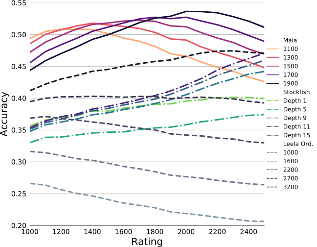

<link rel="stylesheet" href="assets/js/chessboardjs/css/chessboard-1.0.0.css" />

<link rel="stylesheet" href="assets/css/style.css" />
<link rel="stylesheet" href="assets/css/widget_boards.css" />

## Disclaimer

This interactive widget is intended to be a supplement and inline with our blog post. It is aimed at the general reader, who we assume knows a little bit about chess. It is also still in development, I'm not very good at web dev, so there will be UI issues. The colours/CSS are not final either and are one of the things I want feedback on.

Also, the chess board is a fixed width `400px` so weird things will happen if you view on a narrow screen.

<!--
## Quick summary

This is to go with work I did late last year. The main result was a series of chess engines, we called Maia, that can predict the next move a player will make with decent accuracy. The full blog post can be fond [here](/blog/2020/08/24/maia_chess_kdd/)

The main summary of the results is shown in figure 1

-->

## Widget Intro

While we have done some surface level exploration of the boards that Maia was tested, their sheer numbers make substantial human exploration impossible. This simple viewer alone has 174,248 separate boards. But we do expect some of them to interesting and hope that methods like ours can be used to explore the possibility space of chess.

Below is a tool for exploring how our different models agree and disagree. All the boards and player moves are from real games on lichess, so you can select the approximate rating of both players, and if the next move made was a mistake.

Then you can select which models correctly predicted the player's move by clicking on the underlined text. If `Force continuous` is enabled then only two options will be enabled, disable it to see any combination.

There is also the option to scan through different boards with the same settings. The number of boards available varies depending on how unusual a model agreement matrix was selected. You can even find combinations with no examples (hint, mistakes stockfish guessed correctly).

The info field is incomplete, and will probably be a collapsible element. The main interesting element is the link value which takes you to the game on lichess where the board is from.

## Board Explore



## Game Explore



## What Maia Sees



Alternate view


